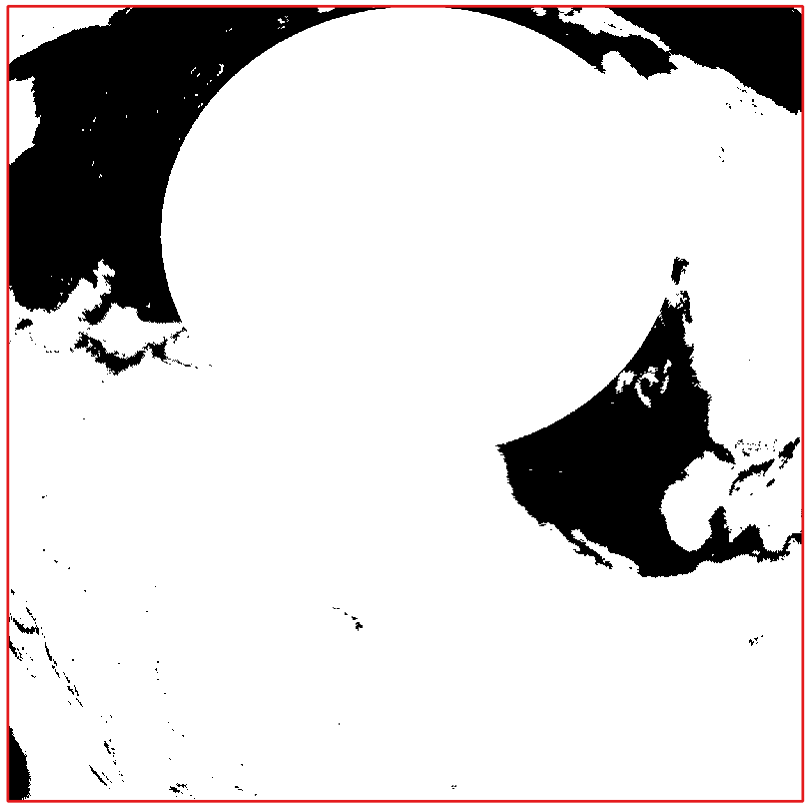
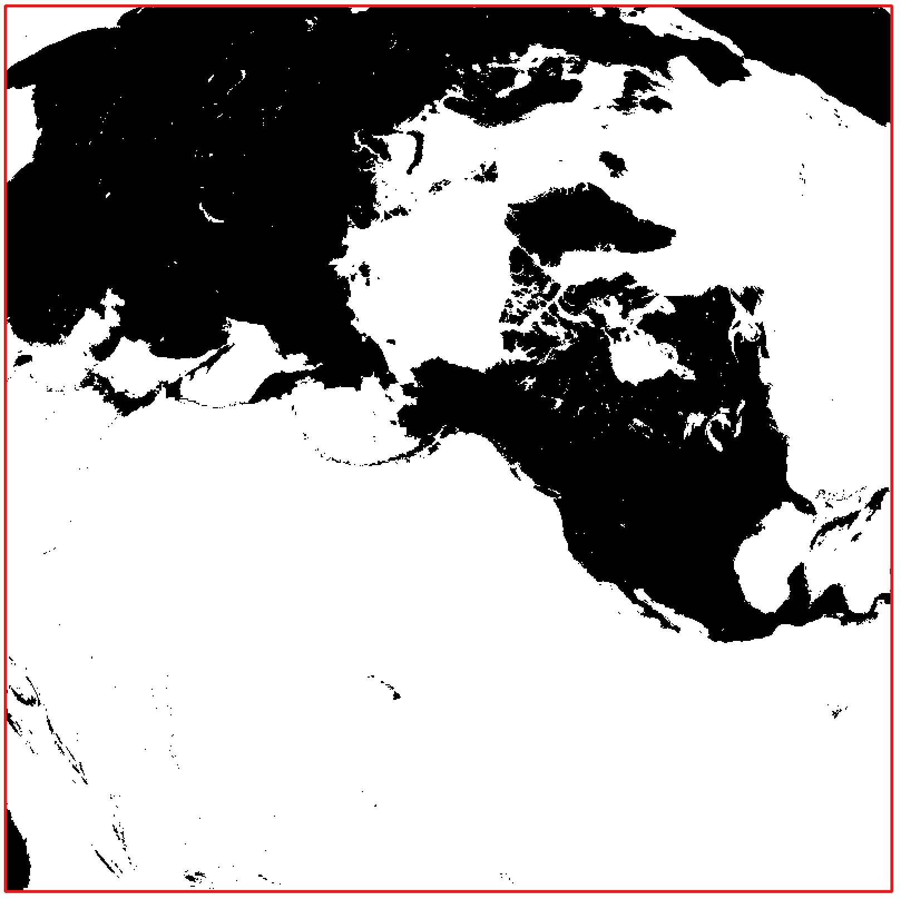

I have a raster of MODIS data with global extent in a specific sinusoidal projection:

```
+proj=sinu +lon_0=0 +x_0=0 +y_0=0 +R=6371007.181 +units=m +no_defs 
```

and I'm trying to use `gdalwarp` to project these data to a Lambert's equal area projection with a constrained extent, but I'm getting a large circular area cropped out of the resulting raster near the pole.

As an example, I've prepared a GeoTIFF in the sinusoidal projection in which land is 1 and water is NoData (lr.tif). I then use the following command:


```
gdalwarp -t_srs "+proj=laea +lat_0=48.514 +lon_0=-145.204 +x_0=0 +y_0=0 +datum=WGS84 +units=m +no_defs" -te -7655830 -6385994 7152182 8423302 lr.tif lr_laea.tif
```

Which gives the resulting raster with a "hole" cropped out around the pole.



I originally assumed I'd provided the extent wrong, however, when use the same `gdalwarp` call on a higher resolution version of the raster (9 times disaggregated), it works fine:

```
gdalwarp -t_srs "+proj=laea +lat_0=48.514 +lon_0=-145.204 +x_0=0 +y_0=0 +datum=WGS84 +units=m +no_defs" -te -7655830 -6385994 7152182 8423302 hr.tif hr_laea.tif
```

